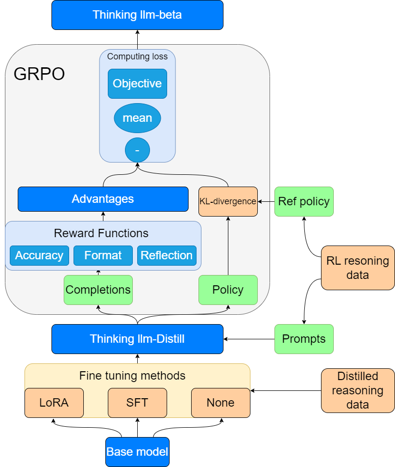

# GRPO_reflection

This repository is the official implementation of the paper: GRPO and Reflection Reward for Mathematical Reasoning in Large Language Models 

## Overview
This repository implements the reasoning methodology from DeepSeek R1-zero, extending the original Open R1 framework with a novel reflection reward mechanism. Our implementation enhances the reasoning process by encouraging self-evaluation and iterative improvement through a composite reward function combining original task rewards with reflection-based incentives.

You can see a detailed description of the project in the report.

The full dataset and model have been stored to [Google Drive](https://drive.google.com/drive/folders/1DhyPW_p0xG4Qv342BuWSqmu84pEXKtTQ?usp=sharing).

If you want to use the project, remember to modify the paths in the project accordingly.

Among them, lora_model.tar stores the trained lora model, thinking_llm_datasets.tar.gz stores all the training and evaluating datasets of sft and grpo, and processed_openr1_dataset.zip stores the preprocessed dataset used to train lora, Qwen-2.5-Math-7B-Thinking-grpo.rar stores the best performing thinking model.

## Workflow



## Models
| Model                                    | MATH-500 | gpqa:diamond | AIME_2024 |
| ---------------------------------------- | -------- | ------------ | --------- |
| Qwen2.5-Math-1.5B                        | 45.4     | 27.27        | 10.00     |
| Qwen2.5-Math-7B                          | 58.6     | 26.26        | 16.67     |
| Qwen2.5-Math-1.5B-sft                    | 58.2     | 35.35        | 3.33      |
| Qwen2.5-Math-1.5B-Math-LoRA-Merged       | 42.2     | 30.81        | 6.67      |
| Qwen-2.5-Math-1.5B-Thinking(sft+grpo)    | 50.0     | 26.26        | 13.33     |
| Qwen-2.5-Math-1.5B-Thinking(only grpo)   | 54.6     | 25.76        | 13.33     |
| Qwen2.5-Math-7B-sft                      | 66.2     | 37.37        | 16.67     |
| Qwen-2.5-Math-7B-Thinking(sft+grpo)      | 57.6     | 41.41        | 16.67     |
| **Qwen-2.5-Math-7B-Thinking(only grpo)** | **73.8** | **34.34**    | **20.00** |

## How to use?

### SFT

```
ACCELERATE_LOG_LEVEL=info accelerate launch --config_file open-r1/recipes/accelerate_configs/zero3.yaml \
    open-r1/src/open_r1/sft.py \
    --config open-r1/recipes/Qwen2.5-Math-7B/sft/config_demo.yaml
```

### GRPO

```
ACCELERATE_LOG_LEVEL=info accelerate launch --config_file open-r1/recipes/accelerate_configs/zero2.yaml \
    --num_processes=7 open-r1/src/open_r1/grpo.py \
    --config open-r1/recipes/Qwen2.5-Math-7B/grpo/config_demo.yaml
```

### Evaluate

```
MODEL=specific local paths or model names
MODEL_ARGS="pretrained=$MODEL,dtype=bfloat16,max_model_length=32768,gpu_memory_utilization=0.8,generation_parameters={max_new_tokens:32768,temperature:0.6,top_p:0.95}"  
# if use qwen2.5math series, you should change the max_new_tokens and max_model_length to around 4096.
OUTPUT_DIR=data/evals/$MODEL

# AIME 2024
TASK=aime24
lighteval vllm $MODEL_ARGS "custom|$TASK|0|0" \
    --custom-tasks open-r1/src/open_r1/evaluate.py \
    --use-chat-template \
    --output-dir $OUTPUT_DIR

# MATH-500
TASK=math_500
lighteval vllm $MODEL_ARGS "custom|$TASK|0|0" \
    --custom-tasks open-r1/src/open_r1/evaluate.py \
    --use-chat-template \
    --output-dir $OUTPUT_DIR

# GPQA Diamond
TASK=gpqa:diamond
lighteval vllm $MODEL_ARGS "custom|$TASK|0|0" \
    --custom-tasks open-r1/src/open_r1/evaluate.py \
    --use-chat-template \
    --output-dir $OUTPUT_DIR

```

