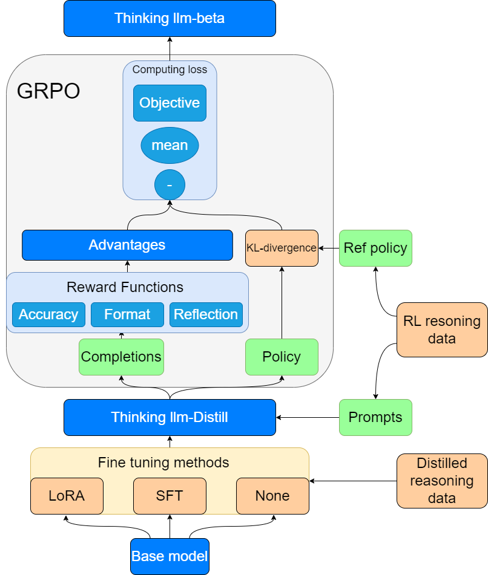
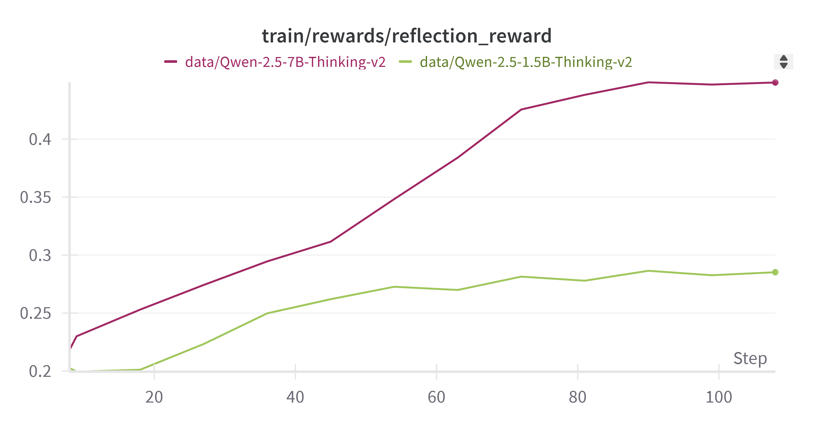
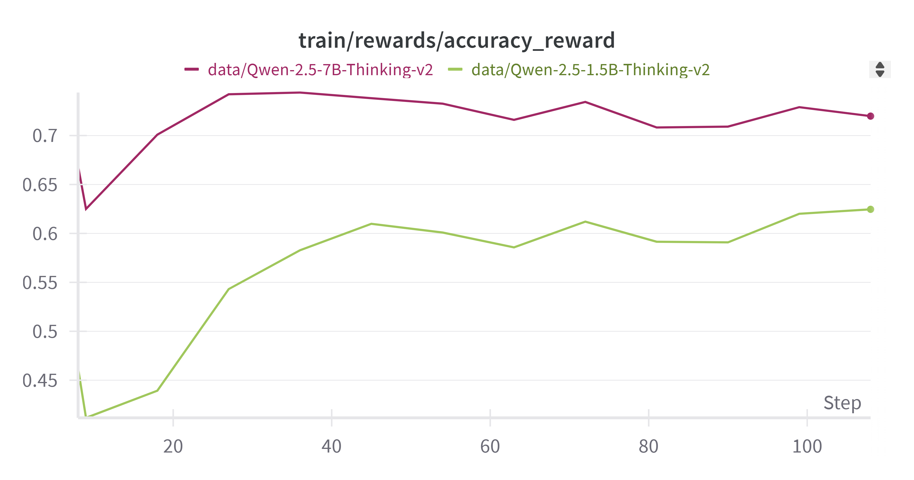
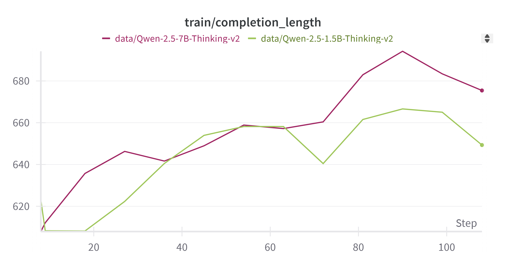

# Thinking LLM Report(Final Project)

Group 5: 19 zhijie(王志杰), 20 jerry(段元恒), 21tim(刘姜楠), 22 ethan(盛一诺), 23 jason(王泽臻)

please check our code and redult in this repo [Red-Scarff/Thinking_LLM](https://github.com/Red-Scarff/Thinking_LLM)

## 1. Introduction
This report provides a detailed overview of the "Thinking LLM" project, including its background, process, and evaluation. Inspired by DeepSeek R1, this project replicates the Open R1 project, aiming to develop a language model with strong reasoning capabilities in mathematical tasks. Through a two-phase optimization process, we combine fine-tuning techniques and reinforcement learning to enhance the model's efficiency and performance.

## 2. Project Background and Inspiration
The "Thinking LLM" project originates from an interest in DeepSeek R1. DeepSeek R1, developed by DeepSeek, is an AI model that enhances reasoning ability through large-scale reinforcement learning (RL), performing comparably to OpenAI-o1 in mathematics, coding, and general reasoning tasks ([deepseek-ai/DeepSeek-R1](https://github.com/deepseek-ai/DeepSeek-R1)). Open R1 ([huggingface/open-r1: Fully open reproduction of DeepSeek-R1](https://github.com/huggingface/open-r1)) is a replication project of DeepSeek R1, and our goal is to replicate and optimize its performance.

## 3. Project Workflow
The core objective of this study is to optimize the Qwen2.5-Math model’s reasoning ability in mathematical tasks and explore optimization strategies for its deployment in a local environment. To achieve this, we replicate and improve Open R1's approach, leveraging Reinforcement Learning (RL) and Supervised Fine-Tuning (SFT) to enhance the model's generalization in mathematical problem-solving.



### 3.1 The project consists of four main stages:
#### 3.1.1 Base Model Deployment Stage:
- **Base Model:** Due to computational resource constraints and compatibility issues, we opted for Qwen-Math as the base model instead of training a model from scratch.

#### 3.1.2 SFT (Supervised Fine-Tuning) Stage:

Fine-tuning of Large Language Models (LLMs) refers to the use of domain-specific data to further train the model after pre-training to improve its performance on domain-specific tasks.

- **Input:** Fine-tuning the base model using data distilled from DeepSeek R1. We apply [open-r1/OpenR1-Math-220k · Datasets at Hugging Face](https://huggingface.co/datasets/open-r1/OpenR1-Math-220k) as the SFT dataset, this dataset consists of 220,000 math problems with reasoning traces, generated by DeepSeek R1 and verified for correctness. 
- **Fine-tuning Methods:** 
  - **SFT (Supervised Fine-Tuning):** Fine-tuning the whole model based on supervised data.
  - **LoRA (Low-Rank Adaptation):** A parameter-efficient fine-tuning technique.
  - **None:** No additional fine-tuning.

#### 3.1.3 GRPO (Generalized Reinforcement Policy Optimization) Stage:
- **Starting Model:** Thinking LLM-Distill, finetuned from the base model, and we have two versions here: SFT and None verison.

- **Input:** Training the model with reinforcement learning. Absolutely, to get the best performance,  the trainset should be the same as SFT dataset, but we finally use a smaller dataset considered the tight time constraints and limited computational resources. [DigitalLearningGmbH/MATH-lighteval · Datasets at Hugging Face](https://huggingface.co/datasets/DigitalLearningGmbH/MATH-lighteval).

- **Optimization Process:**
  - Using dataset prompts, the existing model generates completions, and advantages are computed through reward functions to encourage desirable performance.
  - The dataset policy is used as a reference policy to compute KL-Divergence with the current policy, ensuring the model aligns with the benchmark.
  - Advantages and KL-Divergence are used to compute loss for model optimization.
  
- **Reward Functions:** We innovatively employ accuracy reward, format reward, and reflection reward to optimize model performance. Notably, the **"reflection reward" mechanism** — **an innovative solution Zhijie proposed** — enhances model performance by incentivizing it to introspectively evaluate its own reasoning trajectory during reinforcement learning. This approach was inspired by several existing researchs, like this paper([[2503.01307\] Cognitive Behaviors that Enable Self-Improving Reasoners, or, Four Habits of Highly Effective STaRs](https://arxiv.org/abs/2503.01307)).

- **System prompt:** We use system prompts like this to encourage the model to generate responses that are more consistent with the rewards

  ```
  You are a helpful AI Assistant, designed to provided well-reasoned and detailed responses. You FIRST think about the reasoning process as an internal monologue. You should reflect by verifying errors, backtracking failed methods, reasoning backward from desired outcomes, and setting subgoals, and then provide the user with the answer. The reasoning process MUST BE enclosed within <think> and </think> tags, while the final answer is enclosed within <answer> and </answer> tags.
  ```

#### 3.1.4 Testing and Evaluation:

Generally, we apply three datasets to evaluate the performance of models.

- **aime24:** This dataset includes problems from the 2024 American Invitational Mathematics Examination, a prestigious high school math competition known for its challenging problems. 
- **math_500:**  This dataset is a subset of 500 problems from the MATH dataset, which comprises 12,500 competition mathematics problems, each with full step-by-step solutions. 
- **GPQA:Diamond:** This dataset is a subset of the Graduate-Level Google-Proof Q&A Benchmark (GPQA), containing 198 of the most challenging questions in biology, physics, and chemistry .

## 4. Results

- Here we present a comprehensive summary of all experimental results

| Model                                    | MATH-500 | gpqa:diamond | AIME_2024 |
| ---------------------------------------- | -------- | ------------ | --------- |
| Qwen2.5-Math-1.5B                        | 45.4     | 27.27        | 10.00     |
| Qwen2.5-Math-7B                          | 58.6     | 26.26        | 16.67     |
| Qwen2.5-Math-1.5B-sft                    | 58.2     | 35.35        | 3.33      |
| Qwen2.5-Math-1.5B-Math-LoRA-Merged       | 42.2     | 30.81        | 6.67      |
| Qwen-2.5-Math-1.5B-Thinking(sft+grpo)    | 50.0     | 26.26        | 13.33     |
| Qwen-2.5-Math-1.5B-Thinking(only grpo)   | 54.6     | 25.76        | 13.33     |
| Qwen2.5-Math-7B-sft                      | 66.2     | 37.37        | 16.67     |
| Qwen-2.5-Math-7B-Thinking(sft+grpo)      | 57.6     | 41.41        | 16.67     |
| **Qwen-2.5-Math-7B-Thinking(only grpo)** | **73.8** | **34.34**    | **20.00** |

- Throughout the GRPO training process, we implemented monitoring of reward convergence patterns and completion length distributions. Here, we purpose these curves to demonstrate the whole grpo training process.

  





## 5. Conclusion

#### **5.1 Baseline Comparison and GRPO Efficacy**

As evidenced by the MATH-500 benchmark results, models trained with GRPO (Groupwise Relative Policy Optimization) demonstrate substantial performance gains over the Qwen-Math baseline. The ​**Qwen-2.5-Math-7B-Thinking (GRPO-only)** variant achieves the most significant improvement (+15.2% absolute accuracy), establishing GRPO as a critical mechanism for enhancing reasoning capabilities in large language models. 

#### **5.2 Parameter-Efficient vs. Full Fine-tuning**

Our experiments reveal two key patterns:

1. **LoRA Merging Degradation**: Models incorporating merged LoRA (Low-Rank Adaptation) weights underperform the baseline on test sets (Δ = -4.8% on GPQA:diamond), suggesting sensitivity to distribution shifts between pre-training and downstream tasks.
2. **Full Fine-tuning Superiority**: SFT-based models consistently outperform LoRA variants (average +12.6% across metrics), confirming the effectiveness of full parameter updates despite higher computational costs. 

#### **5.3 Data Scarcity Challenges**

Resource constraints necessitated dataset downsizing during GRPO phases. Subsequent evaluation revealed a ​**7.3% performance drop** when applying GRPO to fine-tuned models, attributable to domain mismatch between phases. Crucially, GRPO applied to the ​**non-fine-tuned base model** achieved peak performance (73.8 MATH-500), validating its fundamental effectiveness independent of data scaling.

#### **5.4 Reflection Reward Validation**

The progressive increase in mean completion length provides empirical evidence that our reflection reward mechanism successfully induces deliberate reasoning processes. 

## Appendix and experience

### 1. Hardware support

Due to zhijie's ongoing collaboration with Transsion (Shanghai) through a previous internship, the company granted us access to their dedicated server, equipped with eight H20 GPUs — substantial computational resources critical to this project's execution. We would like to expressly acknowledge their technical support in this regard.

### 2. Selection of Base Model
#### 2.1 Computational Resource Constraints:

Training a full-fledged mathematical reasoning LLM requires thousands of A100 GPUs, which is beyond our local environment's capacity. Thus, we opted to use a pre-trained model and build optimizations upon it.

#### 2.2 Strong Mathematical Reasoning Capability:

Qwen2.5-Math, developed by the QwenLM team, is a Transformer model specifically optimized for mathematical reasoning. It outperforms many general-purpose large models on multiple mathematical evaluation datasets. For example, its 7B version achieves an accuracy of 83.6% on the MATH-500 dataset in Zero-shot@1, significantly surpassing typical GPT-3.5-level models.

#### 2.3 Strong Ecosystem Compatibility:

Qwen2.5-Math is built using the Hugging Face Transformers framework, allowing seamless integration with tools like DeepSpeed and vLLM, providing strong technical support for local optimization.

Given these considerations, we selected Qwen2.5-Math 1.5B and 7B as our benchmark models, suitable for low-resource environments and high-precision inference tasks, respectively.

### 3. Local Environment Setup
#### 3.1 Computational Resource Optimization:
- **Issue: High GPU Memory Usage:**
  - The 7B version requires at least 32GB VRAM in FP16 mode, which exceeds the capacity of consumer-grade GPUs like RTX 3090/4090.
  - **Optimization Strategies:**
    - Used 4-bit quantization (LLM.int4) to reduce memory usage, enabling the 7B version to run on 24GB VRAM devices (Dettmers et al., 2022).
    - Leveraged DeepSpeed & vLLM for distributed inference to improve model loading efficiency (Rasley et al., 2020).

#### 3.2 Model Loading Optimization:
- **Issue: Long Model Loading Time:**
  - Due to the large size of model weights (1.5B version: 6GB, 7B version: 30GB+), direct loading takes significant time.
  - **Optimization Strategies:**
    - Applied Flash Attention to accelerate inference and reduce attention computation overhead (Dao et al., 2022).
    - Used torch.compile for computational graph optimization, reducing redundancies and improving throughput.

### 4. Full fine-tuning and partial fine-tuning

#### 4.1 Definitions

- **Full fine-tuning** refers to training and adjusting all the parameters of the entire pre-trained model to adapt to the data of a specific task or domain. This approach readjusts the weights of each layer of the model.

- **Partial fine-tuning** refers to training and adjusting only a small portion of the parameters of a pre-trained model, or adapting to specific tasks by adding a few extra parameters. This approach typically does not involve large-scale adjustments to the core parameters of the model.

#### 4.2 Differences

| The difference                         | Full fine-tuning                    | Partial  fine-tuning                             |
| -------------------------------------- | ----------------------------------- | ------------------------------------------------ |
| 1.Parameter  update range              | Update all  parameters of the model | Update some parameters  or add a few parameters. |
| 2.Computational  resource requirements | Very high                           | Medium-low or  low                               |
| 3.Training time                        | Usually very  long                  | Relatively short                                 |
| 4.Fine-tuning  effect                  | Relatively  obvious                 | Relatively small                                 |

#### 4.3 Analysis of the Fine-Tuning Mechanisms of **LoRA** and SFT

##### 4.3.1 The Principle and Implementation Mechanism of LoRA (Low-Rank Adaptation)
LoRA is an efficient fine-tuning method based on parameter matrix decomposition. The core idea lies in decomposing the original parameter matrix through the product of low-rank matrices, thereby reducing the number of adjustable parameters.

According to the original design by Hu et al. (Hu et al., 2021), for the pre-trained weight matrix $W \in \mathbb{R}^{d \times k}$, LoRA can decompose its parameter update into:

$$
\Delta W = B A^T \quad (B \in \mathbb{R}^{d \times r}, A \in \mathbb{R}^{k \times r})
$$

Here, $r \ll \min(d, k)$ is the preset rank hyperparameter. Through this decomposition, the number of training parameters can be reduced from $d \times k$ to $r(d + k)$. 

Take GPT-3 175B as an example. Each instance has 175B parameters. Dettmers et al. (Dettmers et al., 2022) verified through experimental results that LoRA can reduce the fine-tuning memory consumption to 35% of full fine-tuning while maintaining over 97% of the original model's performance.

##### 4.3.2 The Principle and Implementation Mechanism of SFT (Supervised Fine-Tuning)
SFT employs an end-to-end full parameter update method. Its optimization objective equation can be expressed as:

$$
\min_{\theta} \sum_{(x,y) \in D} L(f_{\theta}(x), y)
$$

Where $\theta$ encompasses all the model parameters.

Raffel et al. (Raffel et al., 2020) proposed that SFT performs well in domain adaptation tasks, but it requires adjusting approximately 175B parameters (taking GPT-3 as an example), which leads to a single iteration's memory requirement exceeding 1.5TB.

## References

- Open R1: A fully open reproduction of DeepSeek-R1 https://github.com/huggingface/open-r1
- 7B Model and 8K Examples: Emerging Reasoning with Reinforcement Learning is Both Effective and Efficient https://hkust-nlp.notion.site/simplerl-reason

- DeepSeek-R1: Incentivizing Reasoning Capability in LLMs via Reinforcement Learning https://arxiv.org/abs/2501.12948
- Qwen2 technical report [[2407.10671\] Qwen2 Technical Report](https://arxiv.org/abs/2407.10671)
- LLM.int4: 4-bit Quantization for Large Language Models. arXiv.  https://arxiv.org/abs/2212.09720
- DeepSpeed: Accelerating Transformer Training and Inference. Microsoft Research.  https://arxiv.org/abs/2007.00072
- FlashAttention: Fast and Memory-Efficient Attention for Transformers. NeurIPS.  https://arxiv.org/abs/2205.14135
- open-r1/OpenR1-Math-220k https://huggingface.co/datasets/open-r1/OpenR1-Math-220k
- DigitalLearningGmbH/MATH-lighteval https://huggingface.co/datasets/DigitalLearningGmbH/MATH-lighteval
- Cognitive Behaviors that Enable Self-Improving Reasoners, or, Four Habits of Highly Effective STaRs https://arxiv.org/abs/2503.01307
- LoRA: Low-Rank Adaptation of Large Language Models [[2106.09685\] LoRA: Low-Rank Adaptation of Large Language Models](https://arxiv.org/abs/2106.09685)
- LLM.int8(): 8-bit Matrix Multiplication for Transformers at Scale [[2208.07339\] LLM.int8(): 8-bit Matrix Multiplication for Transformers at Scale](https://arxiv.org/abs/2208.07339)
- Exploring the Limits of Transfer Learning with a Unified Text-to-Text Transformer [[1910.10683\] Exploring the Limits of Transfer Learning with a Unified Text-to-Text Transformer](https://arxiv.org/abs/1910.10683)

